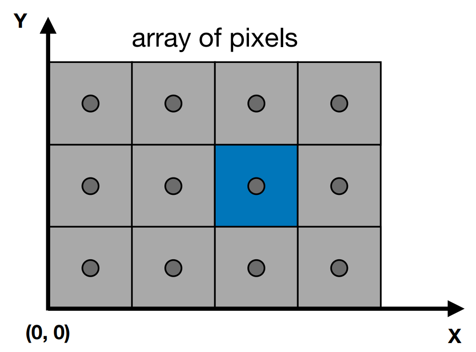
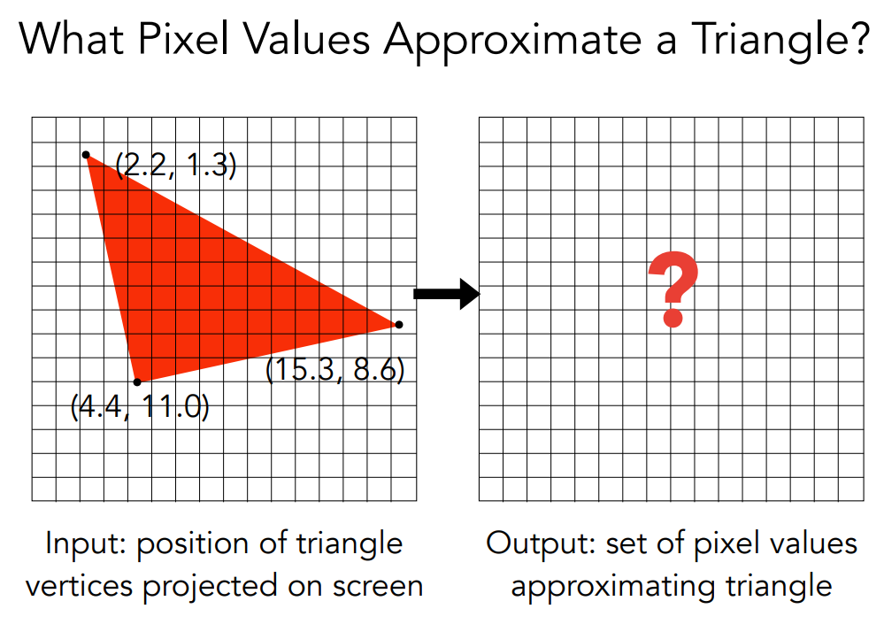
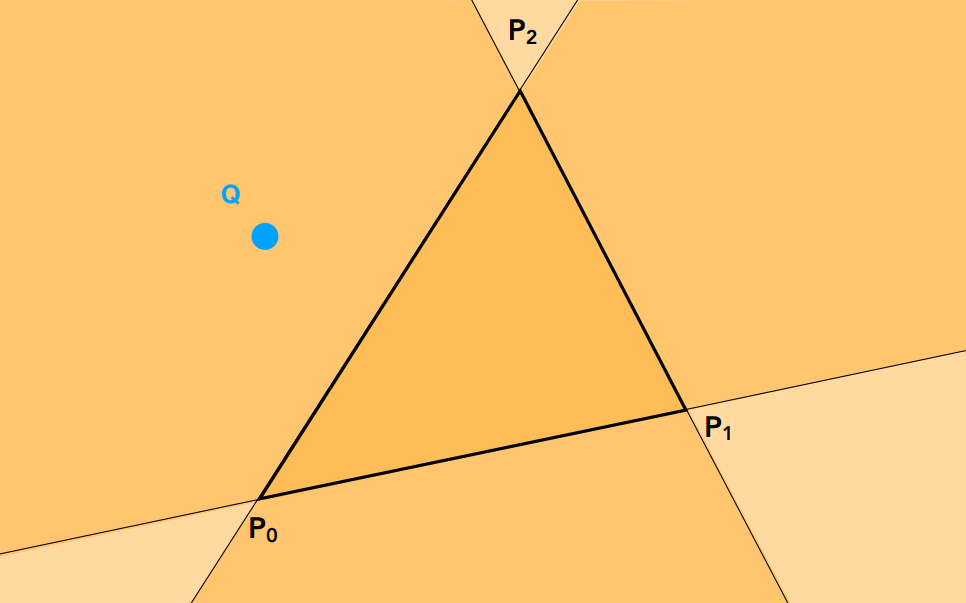
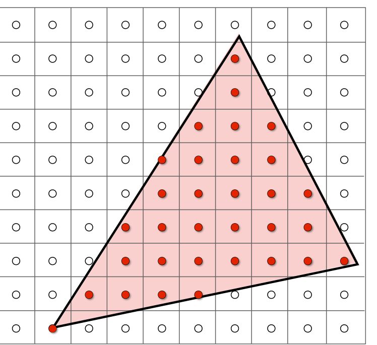
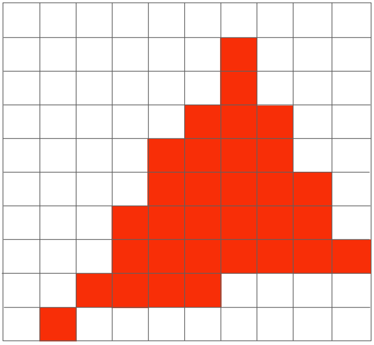
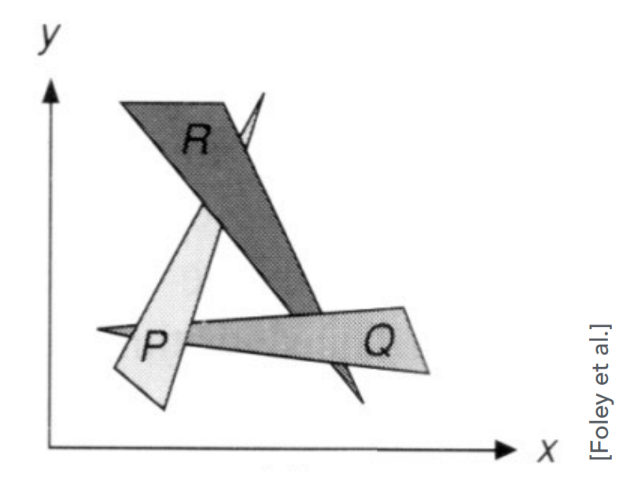

## Shading I

By now, we are able to draw shapes onto our screen in the exact color we specify to each vertex (after interpolation). Shading is the technique of "".   $\newcommand {\b}{\mathbf} \newcommand{\para}{\mathbin{\!/\mkern-5mu/\!}}$

### Viewport Transformation

A viewport transformation $\mathcal U$ involves stretching and translation that maps all $x$-$y$ slices of the canonical cube $K$ to the screen space. Given a screen of height $H$ and width $W$ in units of pixels, we define the 2D screen-space coordinate following the convention that

- The origin of the screen space is at the bottom-left of the display.
- The $y$ axis of the screen-space coordinate points upward and the $x$ component rightward to the display.
- Each pixel $(i, j),\ i\in[0..W),j\in[0..H)$ is a unit square centered at $(x_i,x_j)=(i+0.5,j+0.5)$ in screen space.



Under this setup, we can represent $\mathcal U$ easily in the matrix form as
$$
\b U =\left[\begin{array}{ccc}
\frac{W}{2}&0&0&\frac{W}{2}
\\
0&\frac{H}{2}&0&\frac{H}{2}
\\
0&0&1&0
\\
0&0&0&1
\end{array}\right]
$$
Note that we leave the $z$ component untouched since it will be helpful later (Z-buffer) in deciding occlusion when triangles overlap in screen space.

### Rasterizing a triangle

#### Why triangles?

Triangles have a number of nice properties as a fundamental geometric primitive:

- It breaks up other planer shapes (polygons).
- It is guaranteed to be planar (Three non-colinear points uniquely define a plane)
- It has a well-defined interior (Easy to test algorithmically, up next)
- It is easy to interpolate between vertices (Barycentric coordinates, up next)

#### Rasterization = discrete samples



Suppose we'd like to rasterize a red triangle $T$ with vertices already transformed to screen space, as shown on the left. Surely, it is impossible to be fully authentic here due to the finitely many pixels at our disposal. The question is, then, how should we set the value of each pixel on the right so that the raster image on the right resemble the original triangle?

A straightforward idea is to *sample* at discrete locations, say at the center of each pixel, and color the pixel red if the sampled location is inside the triangle. Formally, this amounts to discrete evaluation of the indicator function
$$
I_T(x,y)=\begin{cases}
1\quad:\text{point }(x,y)\text{ inside } T\\
0\quad:\text{otherwise}
\end{cases}
$$
at locations $(i+0.5,j+0.5)$ for all pixels $(i,j)$. 

It begs the question: How do we actually evaluate $I_T$? As we shall see next, this can be done by a straightforward application of the cross product. 

#### Deciding the interior of a triangle

Suppose the three vertices of the triangle $T$ are $\b p_0,\b p_1,\b p_2$ in screen-space coordinates. Imagine a truck traveling along the boundary of the triangle, say $\b p_0\to\b p_1\to\b p_2\to\b p_0$, the critical observation is that any point inside the triangle necessarily stays on the *same side* of the truck (In our case, it stays on the left), whereas any point outside the triangle must see the truck on the left at some moment, and on the right at another.

See the following figure for an example, where the left half-plane of each directed path $(\b p_0\b p_1,\b p_1\b p_2,\b p_2\b p_0)$ is shaded yellow. The interior of the triangle exactly matches the triply-shaded region.



How should we decide if a point $\b q$ is on the *left* of the path $\b p_i\b p_j$? This happens when the angle between $\b p_i\b p_j$ and $\b p_i\b q$ is in the range $(0,\pi)$. In other words, $(\b p_i\b p_j\times\b p_i\b q)_z\gt 0$. Enforcing this for all path of the triangle, we must have
$$
(\b p_i\b p_j\times\b p_i\b q)_z\gt 0\quad \forall \text{path }\b p_i\b p_j
$$
If the order of the vertices is arbitrary, we also need to account to the possibility that the truck travels in the reversed order $\b p_0\to\b p_2\to\b p_1\to\b p_0$, so that an interior point $\b q$ is always on the *right* of the each path. This amounts to the condition that
$$
(\b p_i\b p_j\times\b p_i\b q)_z\lt 0\quad \forall \text{path }\b p_i\b p_j
$$
In summary, we have the convenient characterization
$$
\text{point }(x,y)\text{ inside } T\iff(\b p_i\b p_{(i+1)\text{mod} 3}\times\b p_{i}\b q)_z\ \text{ have same sign for } i=0,1,2
$$
where $\b q =(x,y,0)$.

#### Antialiasing

The basic idea of sampling looks simple. Nonetheless, a closer inspection of the rasterization result may bring unsettling news: The raster image of the triangle definitely looks a lot more jagged than ideal. What went wrong?

|               Pixel-center sampling a triangle               |                         Raster image                         |
| :----------------------------------------------------------: | :----------------------------------------------------------: |
|  |  |

We can use sampling theory to explain this phenomenon. As discussed earlier, a triangle in screen space can be thought of as an indicator function $I$ on the domain $\R^2$. Due to its finite support, $I$ is a band-limited signal. ==[WIP]==

### Z-buffering

Different algorithms exist for handling occlusion among triangles. The *painter's algorithm* assigns a single depth to each triangle, sorts them, and draw the triangles back to front. Since each triangle owns a single depth, painter's algorithm cannot handle the scenario in which a portion of the triangle $A$ is behind triangle $B$ and the rest in front.

*Fig*: Overlapping triangles. Impossible to draw individually based on single depth

The z-buffering algorithm solves the problem by maintaining two buffers, one called the *frame buffer* storing color values, and another called the *depth buffer* (or *z-buffer*) that stores depth values. The algorithm draws each triangle by iterating over the sample within the triangle, comparing depth of individual sample with the recorded smallest, and optionally updating both buffers if the new depth is smaller (i.e., the new sample is in front of the old one).

```pseudocode
/* Z-buffering Algorithm */
foreach sample index (i, j):
    depthBuf[i, j] = ∞
    frameBuf[i, j] = BG_COLOR

foreach triangle T:
	foreach sample (x, y, z) in T:
		if z < depthBuf[y, x]:
			frameBuf[y, x] = T.getColor(x, y, z)
			depthBuf[y, x] = z
```

Assuming each triangle $T$ covers a constant number of samples, it is not hard to see the z-buffering algorithm takes $O(n)$ time for $n$ triangles.

### References

[1] https://sites.cs.ucsb.edu/~lingqi/teaching/games101.html

---

**Next:** Shading I

*To be continued.*


